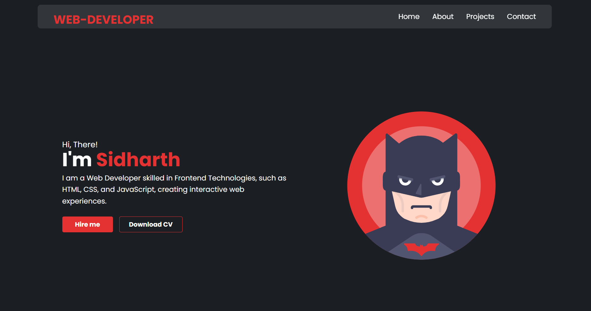

# 💼 React Portfolio Template 🌐

Welcome to the **React Portfolio Template**! 🚀  
A clean, responsive, and beginner-friendly portfolio built using **React.js**. Perfect for individuals who want to showcase their work, skills, and personality online with minimal setup and easy customization. 🎨💻

---

## ✨ Features

- ✅ **Responsive Design** – Looks great on all devices 📱💻
- ⚛️ **Built with React** – Lightweight, component-based structure
- 🛠️ **Easy to Customize** – Just edit a few files to make it your own
- 🎯 **Clean & Minimal UI** – Professional and simple design
- 📁 **Well-Structured Code** – Beginner-friendly and easy to follow

---

## 📸 Preview

  
*(You can replace this with your own screenshot)*

---

## 🚀 Getting Started

Follow these steps to run the portfolio locally:

```bash
# 1️⃣ Clone the repository
git clone https://github.com/electron244/Batman-Theme-Portfolio.git

# 2️⃣ Navigate to the folder
cd react-portfolio-template

# 3️⃣ Install dependencies
npm install

# 4️⃣ Start the development server
npm start
